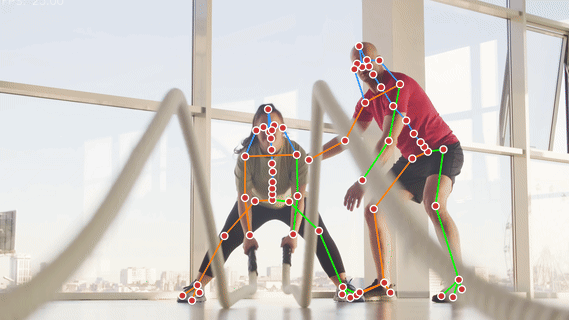

# Towards Unconstrained 2D Pose Estimation of the Human Spine

<div align="center">

[](https://saifkhichi.com/research/spinepose/)
[](https://doi.org/10.57967/hf/5114)
[](https://arxiv.org/abs/2504.08110)
[](https://vap.aau.dk/cvsports/)
[](https://pypi.org/project/spinepose/)



</div>

---

## Contents
- [Abstract](#abstract)
- [Installation](#installation)
- [Inference](#inference)
- [SpineTrack Dataset](#spinetrack-dataset)
- [Training and Evaluation](#training-and-evaluation)
- [Citation](#citation)
- [License](#license)

---

## Abstract
We present SpineTrack, the first comprehensive dataset for 2D spine pose estimation in unconstrained settings, addressing a crucial need in sports analytics, healthcare, and realistic animation. Existing pose datasets often simplify the spine to a single rigid segment, overlooking the nuanced articulation required for accurate motion analysis. In contrast, SpineTrack annotates nine detailed spinal keypoints across two complementary subsets: a synthetic set comprising 25k annotations created using Unreal Engine with biomechanical alignment through OpenSim, and a real-world set comprising over 33k annotations curated via an active learning pipeline that iteratively refines automated annotations with human feedback. This integrated approach ensures anatomically consistent labels at scale, even for challenging, in-the-wild images. We further introduce SpinePose, extending state-of-the-art body pose estimators using knowledge distillation and an anatomical regularization strategy to jointly predict body and spine keypoints. Our experiments in both general and sports-specific contexts validate the effectiveness of SpineTrack for precise spine pose estimation, establishing a robust foundation for future research in advanced biomechanical analysis and 3D spine reconstruction in the wild.

---

## Installation
**Recommended Python Version:** 3.9–3.12

```bash
pip install spinepose
```

On Linux/Windows with CUDA available, install the GPU version:

```bash
pip install spinepose[gpu]
```

> [!NOTE]
> For model training or reproducing the full pipeline, please refer to the [Training and Evaluation](#training-and-evaluation) section.

## Inference

The `spinepose` package provides a command-line interface and a Python API for quick spinal keypoint predictions on images and videos.

### Using the CLI

```bash
spinepose -i /path/to/image_or_video -o /path/to/output
```

This automatically downloads the model weights (if not already present) and outputs the annotated image or video. Use spinepose -h to view all available options, including GPU usage and confidence thresholds.

### Using the Python API

```python
import cv2
from spinepose import SpinePoseEstimator

# Initialize estimator (downloads ONNX model if not found locally)
estimator = SpinePoseEstimator(device='cuda')

# Perform inference on a single image
image = cv2.imread('path/to/image.jpg')
keypoints, scores = estimator.predict(image)
visualized = estimator.visualize(image, keypoints, scores)
cv2.imwrite('output.jpg', visualized)
```

Or, for a simplified interface:

```python
from spinepose.inference import infer_image, infer_video

# Single image inference
infer_image('path/to/image.jpg', 'output.jpg')

# Video inference with optional temporal smoothing
infer_video('path/to/video.mp4', 'output_video.mp4', use_smoothing=True)
```

## SpineTrack Dataset

SpineTrack is available on [HuggingFace](https://doi.org/10.57967/hf/5114). The dataset comprises:

- **SpineTrack-Real**
  A collection of real-world images annotated with nine spinal keypoints in addition to standard body joints. An active learning pipeline, combining pretrained neural annotators and human corrections, refines keypoints across diverse poses.

- **SpineTrack-Unreal**
  A synthetic subset rendered using Unreal Engine, paired with precise ground-truth from a biomechanically aligned OpenSim model. These synthetic images facilitate pretraining and complement real-world data.

To download:

```bash
git lfs install
git clone https://huggingface.co/datasets/saifkhichi96/spinetrack
```

Alternatively, use `wget` to download the dataset directly:

```bash
wget https://huggingface.co/datasets/saifkhichi96/spinetrack/resolve/main/annotations.zip
wget https://huggingface.co/datasets/saifkhichi96/spinetrack/resolve/main/images.zip
```

In both cases, the dataset will download two zipped folders: `annotations` (24.8 MB) and `images` (19.4 GB), which can be unzipped to obtain the following structure:

```plaintext
spinetrack
├── annotations/
│   ├── person_keypoints_train-real-coco.json
│   ├── person_keypoints_train-real-yoga.json
│   ├── person_keypoints_train-unreal.json
│   └── person_keypoints_val2017.json
└── images/
    ├── train-real-coco/
    ├── train-real-yoga/
    ├── train-unreal/
    └── val2017/
```

All annotations are in COCO format and can be used with standard pose estimation libraries.

## Training and Evaluation

> [!NOTE]
> Detailed scripts for reproducing our training pipelines, baselines, and evaluation protocols will be provided soon.

---

## Citation

If this project or dataset proves helpful in your work, please cite:

```bibtex
@inproceedings{khan2025cvprw,
    author    = {Khan, Muhammad Saif Ullah and Krauß, Stephan and Stricker, Didier},
    title     = {Towards Unconstrained 2D Pose Estimation of the Human Spine},
    booktitle = {Proceedings of the IEEE/CVF Conference on Computer Vision and Pattern Recognition (CVPR) Workshops},
    month     = {},
    year      = {2025},
    pages     = {}
}
```

## License

This project is released under the [CC-BY-NC-4.0 License](LICENSE). Commercial use is prohibited, and appropriate attribution is required for research or educational applications.
